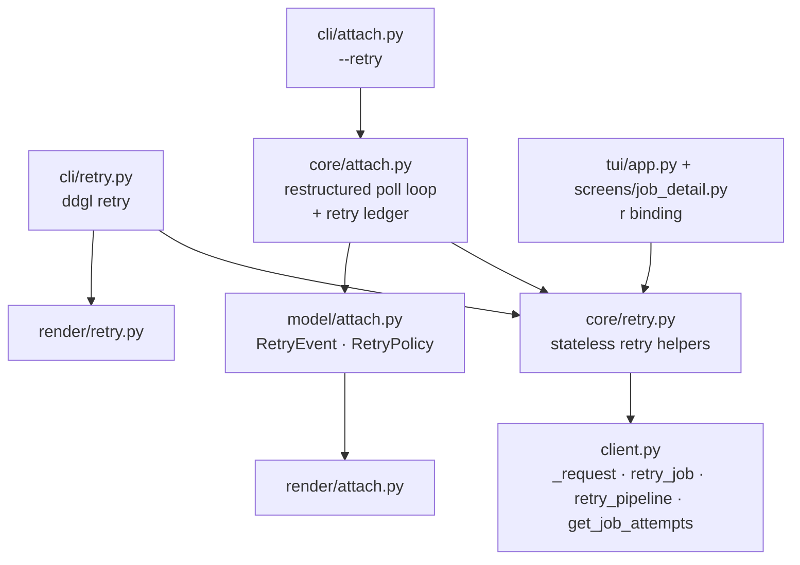
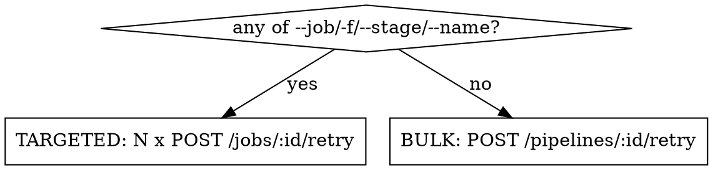

# Retry support in `ddgl`

Add the ability to retry GitLab CI jobs from `ddgl`: as a standalone `ddgl retry` command, from the TUI, and automatically from `ddgl attach`.

> [!IMPORTANT]
> **This ships as two PRs.** §4 splits the work at a hard boundary:
> - **PR 1 — "Distinguish allowed failures"** (§3.2). A small, self-contained data-model + rendering change with no retry code in it. Merges first.
> - **PR 2 — "Retry support"** (everything else). Built on top of PR 1.

---

## 1. Context

### What exists today

| Piece | State |
| --- | --- |
| `src/ddgl/client.py` | **GET-only.** `_get_response` (`src/ddgl/client.py:107`) is the only HTTP primitive; `_raise_for_status` hardcodes the string `"GET"` (`src/ddgl/client.py:176`). |
| `src/ddgl/core/attach.py` | Stateless poll engine, observe-only. Poll loop at `src/ddgl/core/attach.py:288`. |
| `src/ddgl/model/attach.py` | Tagged-union `AttachEvent` hierarchy — adding a kind is cheap. |
| `src/ddgl/tui/app.py` | `r` = refresh (`src/ddgl/tui/app.py:53`). No multi-select. Auto-refresh timer arms **only for running pipelines** (`src/ddgl/tui/app.py:207-210`). |
| TUI modals | Only `FilterModalScreen` (`src/ddgl/tui/widgets/filter_buttons.py:16`) and `HelpModal`. No generic confirm dialog. |
| Global `-y/--yes` | Already defined (`src/ddgl/cli/__init__.py:56`), used by `jobs get` and `logs`. |

The prior attach design explicitly deferred this work:

> `docs/superpowers/specs/2026-07-21-ddgl-attach-design.md:300` — *"**Job retrying** — the client is currently read-only (no POST). Auto-retry of failed jobs is a separate feature; `attach` only observes."*

### GitLab API facts that drive the design

> [!IMPORTANT]
> **A retry mints a new job ID.** `POST /projects/:id/jobs/:job_id/retry` returns a *new* `Job` with a different `id`. `GET /pipelines/:id/jobs` excludes retried records by default, so the old failed job **vanishes** from the list and a new `pending` one takes its place under the same `name`.
>
> The **job name** is therefore the only stable identity across a retry. Anything that has to remember "how many times has this been retried" must key on name, not ID.

| Endpoint | Behaviour |
| --- | --- |
| `POST /projects/:id/jobs/:job_id/retry` | Retries one job. **Returns the new `Job`.** |
| `POST /projects/:id/pipelines/:pid/retry` | Retries **every failed *and canceled*** job. **Returns the `Pipeline` only** — not a list of what it touched. Same as the web UI's Retry button. |
| `GET /pipelines/:pid/jobs?include_retried=true` | The only way to see prior attempts (from a `retry:` keyword or an earlier manual retry). |
| Retrying in a finished pipeline | Flips the pipeline back to `running`, and re-creates downstream `skipped` jobs as new records. |
| Insufficient token scope / non-retryable job | `403`. |

#### Do we need new deserialization? No.

Both POST endpoints return the **same entity shapes** as their GET counterparts — a job object and a pipeline object respectively. `Job.from_api` (`src/ddgl/model/job.py:37`) and `Pipeline.from_api` parse them unchanged. So `retry_job` is `Job.from_api(await self._post(...))`; nothing new is needed in `model/`.

The one genuinely new fetch is the `include_retried=true` job list — but that's the *same* endpoint and shape `get_all_jobs` already handles, just with an extra query param.

---

## 2. Decisions locked in

| Question | Decision |
| --- | --- |
| Command surface | Top-level `ddgl retry` |
| Bulk vs targeted | **No job filter** → `POST /pipelines/:id/retry`. **Any of `--job`/`-f`/`--stage`/`--name`** → N × `POST /jobs/:id/retry` |
| Bulk-mode safety | **Always** a confirmation dialog: *"This will retry all failed and canceled jobs in pipeline #N (ref). Continue?"* |
| Confirmation bypass | Existing global `-y/--yes`. **Non-TTY without `-y` is a hard error**, not an auto-confirm (§3.7) |
| Retrying non-failed jobs | `--force` retries everything the filter matched, including successful jobs (§3.7) |
| What attach auto-retries | Any blocking failure. No `failure_reason` allowlist — but a **name-based exclusion list** is designed in from the start |
| Retry limits | Per-job-name cap **and** a global total: `--retry-attempts` / `--retry-total` |
| GitLab's own `retry:` attempts | Counted, via a new `get_job_attempts` client method, re-tallied on **every tick that has candidates** — never cached, so attempts GitLab adds later can't be missed (§3.5) |
| Racing GitLab's own `retry:` | Skip any failed job that already has a newer record under the same name. Not a delay: job statuses are immutable and the payload never says a job *will* be auto-retried, so "has it already been retried?" is the only decidable question (§3.5) |
| `allow_failure` jobs | Never auto-retried — and the underlying data-model fix ships as **its own PR, first** (§3.2) |
| Result reporting | Exit code unchanged (0/1/2/124). New `retry` event kind + `ResultEvent.retries` count surfaced in the final line |
| `attach` default | **No retry by default.** `--retry` opts in, and covers *both* jobs already failed when you attach *and* failures detected while polling |
| TUI keys | **`r` → retry** (job under the cursor, in both the list and the detail screen). Refresh **moves to `ctrl+r`** |

> [!NOTE]
> **Naming collision.** `RETRY_ATTEMPTS` / `RETRY_BACKOFF_*` in `src/ddgl/constants.py:13-15` are *HTTP transport* retry, nothing to do with this feature. They get renamed to `HTTP_RETRY_*` in PR 2's first commit so the two concepts never read as one.

---

## 3. Architecture



### 3.1 `client.py` — one request helper, two verbs

Rather than writing a parallel `_post_response` that duplicates the attempt loop, backoff maths, `Retry-After` handling and warning logs, **extract the shared machinery first** and express both verbs in terms of it. The retry *policy* becomes a parameter, because it depends on idempotency — which only the caller knows.

```python
# constants.py
class HttpMethod(StrEnum):
    GET = "GET"
    POST = "POST"

# exceptions.py
RATE_LIMITED_STATUS_CODES = frozenset({429})

# client.py
async def _request(
    self,
    method: HttpMethod,
    path: str,
    *,
    params: dict[str, Any] | None = None,
    json: dict[str, Any] | None = None,
    retry_statuses: frozenset[int] = frozenset(),
    retry_transport: bool = False,
) -> httpx.Response:
    """Issue one HTTP request, retrying according to the caller's policy.

    The retry policy is passed in rather than decided here because it
    depends on whether the request is *idempotent*, which only the caller
    knows. A GET can always be safely re-sent. A POST cannot: re-sending
    `POST /jobs/:id/retry` after a timeout or a 502 could mint two jobs,
    because there is no way to distinguish "GitLab never saw it" from
    "GitLab processed it and the response was lost on the way back".

    Args:
        method:
            HTTP verb. The caller also forwards it to `_raise_for_status`
            so `GitLabAPIError` reports the right verb.
        path:
            Path relative to the client's `base_url`.
        params:
            Query-string parameters. GET only, in practice.
        json:
            JSON request body. POST only, in practice.
        retry_statuses:
            HTTP status codes to treat as retryable. Empty (the default)
            means "never retry on status". GET passes
            `RETRYABLE_STATUS_CODES` (408/429/5xx). POST passes
            `RATE_LIMITED_STATUS_CODES` ({429}) only — a 429 means the
            request was *rejected* rather than processed, so re-sending it
            is safe even for a non-idempotent verb.
        retry_transport:
            Whether to retry an `httpx.TransportError` (timeout, DNS
            failure, connection reset — GitLab never responded at all).
            True for GET. **False for POST**: "no response" is precisely
            the ambiguous case where a re-send might duplicate the side
            effect.

    Retries up to `HTTP_RETRY_ATTEMPTS` times with exponential backoff
    (`HTTP_RETRY_BACKOFF_INITIAL_SECONDS` * `HTTP_RETRY_BACKOFF_MULTIPLIER`
    ** attempt), honoring a 429's `Retry-After` header in place of the
    computed delay when one is present and numeric.

    Returns:
        The final `httpx.Response`, whatever its status. Deliberately does
        NOT raise on a non-2xx — callers still run `_raise_for_status`, so
        the exception mapping (ConfigError / NotFoundError /
        GitLabAPIError) stays defined in exactly one place.

    Raises:
        httpx.TransportError:
            The request never got a response, and either `retry_transport`
            is False or the attempts were exhausted.
    """
```

| Caller | `retry_statuses` | `retry_transport` |
| --- | --- | --- |
| `_get_response` | `RETRYABLE_STATUS_CODES` (408/429/5xx) | `True` |
| `_post_response` | `RATE_LIMITED_STATUS_CODES` (`{429}`) | `False` |

Also in this layer:
- `_raise_for_status(resp, method: HttpMethod)` — no more hardcoded `"GET"` at `src/ddgl/client.py:176`. `GitLabAPIError.method` gets re-typed from `str` to `HttpMethod`.
- `retry_job(job_id) -> Job`, `retry_pipeline(pipeline_id) -> Pipeline`.
- `get_all_jobs(..., include_retried: bool = False)`.
- `get_job_attempts(pipeline_id) -> list[Job]` — every job record for a pipeline *including* retried ones. Named "attempts" rather than "retries" to head off the off-by-one: a job that has never been retried has **1 attempt, 0 retries**.

---

### 3.2 PR 1 — Distinguish allowed failures

Agreed: this is a fundamental data-model change with its own user-visible surface, so it ships and merges as **a small standalone PR before any retry code**.

#### Model

```python
# model/job.py
@property
def has_failed(self) -> bool:
    """Status is FAILED, regardless of allow_failure.

    Does NOT account for `allow_failure` — a job with `allow_failure: true`
    that failed returns True here but does not fail the pipeline. Use
    `is_blocking` when you mean "failed in a way that matters".
    """
    return self.status == JobStatus.FAILED

@property
def is_blocking(self) -> bool:
    """Failed in a way that actually fails the pipeline."""
    return self.has_failed and not self.allow_failure
```

#### Behaviour changes

| Call site | Today | After |
| --- | --- | --- |
| `src/ddgl/core/attach.py:55` (`_rollup`) | `failed_jobs` counts allowed failures | Counts only `is_blocking` — so attach's "3 failed" matches the pipeline's actual verdict |
| `src/ddgl/core/jobs.py:111` (`filter_jobs`) | `failed_only` → `has_failed` | `failed_only` → `is_blocking` |
| `src/ddgl/cli/_options.py:71` (`-f/--failed`) | — | New sibling `--include-allowed-failures` restores the old behaviour |

#### A distinct colour, CLI and TUI

GitLab's own UI renders an allowed failure as an **orange warning**, not a red failure. Match that:

| Surface | Today | After |
| --- | --- | --- |
| `src/ddgl/render/_styles.py:10` | `"failed": "red"` | add `"failed_allowed": "orange1"` |
| `src/ddgl/render/_styles.py` (`format_job_status`) | allowed failures render as plain `failed` in red | render as `warning` in orange — shorter than `failed (allowed)` so it fits the TUI's 14-char status column, and matches GitLab's own "passed with warnings" vocabulary rather than inventing new wording |
| `src/ddgl/tui/widgets/status.py:10` | `"failed": ("✗", "#DD2B0E")` | add `("⚠", "#C17D10")` for the allowed variant |
| `src/ddgl/tui/widgets/job_list.py` | one red `failed` cell style | allowed failures get the warning glyph + colour |

> [!WARNING]
> **This is the main mechanical cost of PR 1.** The status→glyph/colour lookups currently take a bare status *string*. "Allowed failure" isn't a status — it's `status == failed AND allow_failure` — so a status string can no longer answer the question.
>
> **These helpers take the `Job`.** That's what the domain model is for: `Job` already carries both fields, and passing it means the next "depends on two fields" case (a `canceling` job, a job whose runner went offline) doesn't require another signature change. The alternative — threading a bare `allow_failure: bool` alongside the status — keeps the helpers technically pure but re-derives, at every call site, a fact the domain object already knows.
>
> Concretely, `src/ddgl/render/_styles.py` and `src/ddgl/tui/widgets/status.py` gain `Job`-taking entry points, and every call site is updated. Shallow but wide — exactly why it deserves its own PR rather than being buried in a retry diff.

#### Filtering on allowed failures

A colour you can see but can't filter by is half a feature, so the filter vocabulary ships in PR 1 too.

`status` is currently a flat string throughout the filter path — `src/ddgl/tui/search.py`'s `status:` token, `FilterSpec.statuses: set[str]`, the dropdown options seeded at `src/ddgl/tui/app.py:74`, and the status ordering/grouping tables at `src/ddgl/tui/widgets/job_list.py:108,137`. "Allowed failure" has to enter that vocabulary as a **pseudo-status**:

| Concern | Approach |
| --- | --- |
| Token | `status:allowed-failure` (and `status:failed` stops matching allowed failures, mirroring `-f/--failed`) |
| Matching | One helper — `def status_token(job: Job) -> str` — returns `"allowed-failure"` for an allowed failure and `str(job.status)` otherwise. The filter path matches against *that*, not against `job.status` directly, so the pseudo-status exists in exactly one place. |
| Dropdown | New entry in the status `FilterButton` options and in the default set at `src/ddgl/tui/app.py:74` |
| Sort/group order | New row in `job_list.py`'s status-rank table, ordered right after `failed` |

Same `Job`-in principle as the styling helpers: `status_token` takes the `Job`, and everything downstream keeps working on strings.

---

### 3.3 `core/retry.py` — stateless helpers only

```python
async def retry_job(client, job_id) -> Job
async def retry_pipeline(client, pipeline_id) -> Pipeline
async def retry_jobs(client, jobs: Sequence[Job]) -> list[RetryOutcome]
async def tally_attempts(client, pipeline_id, names: set[str]) -> AttemptTally

# selection, used by cli/retry.py (§3.7)
async def select_by_id(client, job_ids, *, force=False, cache=None) -> RetrySelection
async def select_in_pipeline(client, pipeline, *, failed_only=False, ...) -> RetrySelection
```

The data types live in `model/retry.py`, not here: `render/` has to consume them to print the outcome table, and nothing else in `render/` imports from `core/`. This mirrors the split `attach` already uses — engine in `core/attach.py`, event types in `model/attach.py`.

```python
class RetryOutcome(msgspec.Struct, frozen=True):
    old_job_id: int
    job_name: str
    new_job: Job | None = None
    error: str | None = None

class AttemptTally(msgspec.Struct, frozen=True):
    counts: dict[str, int]      # attempts recorded per job name
    newest_ids: dict[str, int]  # the most recent record's ID per job name

    def count(self, name: str) -> int
    def is_newest(self, job: Job) -> bool
```

`retry_jobs` fans out concurrently — bounded, via `core/_concurrency.py`'s `gather_bounded`, since a large pipeline can present hundreds of failed jobs at once — and **never raises**: a per-job failure lands in that job's `RetryOutcome.error`, so a partial failure is reportable rather than fatal.

`tally_attempts` wraps `client.get_job_attempts` (`include_retried=true`), the only endpoint that reports superseded records. It returns both halves of what the retry policy needs:

- **`counts`** — the per-job-name attempt total, including attempts GitLab made itself via `retry:`. This is the `--retry-attempts` budget.
- **`newest_ids`** — which record is currently the live one for each name. `is_newest(job)` is how §3.5 avoids racing GitLab's own retry.

Nothing here is cached or carried between calls, so a tally always reflects the instant it was taken.

`retry_job`/`retry_pipeline` take no `cache` argument, unlike the rest of `core/`: a freshly retried job is always `pending` and a retried pipeline always `running`, so neither can ever satisfy the terminal-state gate that makes an object cacheable. They exist so CLI and TUI callers reach retry through `core/` like every other action rather than importing `client.py` directly.

No run-scoped state here. The state that `attach` needs lives in `attach` (§3.5).

Also add `Job.is_retryable` (`status in {FAILED, CANCELED}`) — a deliberate narrowing of GitLab's actual rule, which also permits retrying a *successful* job. `--force` (§3.7) is the escape hatch for the wider set.

`RetryPolicy` — attach-run configuration, so it lives in `model/attach.py` next to `DetailLevel`:

```python
class RetryPolicy(msgspec.Struct, frozen=True):
    enabled: bool = False
    attempts_per_job: int = 2      # 0 = unlimited
    total: int = 50                # 0 = unlimited
    exclude: tuple[str, ...] = ()  # job-name regexes never auto-retried
```

> [!TIP]
> **`exclude` is the door you asked to leave open.** Some jobs genuinely don't survive a retry. It's honoured by the selection logic from day one and exposed as a repeatable `--retry-exclude REGEX`. A per-project exclusion list really belongs in the config file rather than on every invocation — a `[retry] never_retry = [...]` table in `ConfigFile` (`src/ddgl/model/config.py`) is the natural follow-up, and the struct field is already shaped for it.

---

### 3.4 Restructuring the attach poll loop

Bolting retry onto `_attach_events` as an extra `if` with a `continue` would be exactly the fiddly special-casing you flagged. Instead, **restructure the loop first, as its own commit**, then add retry to the clean shape.

The pre-restructure body sleeps at the *top*, which forces the pre-loop code to duplicate the fetch, the caching, the context build and the terminal check. Making the loop *begin* already holding a tick lets the initial snapshot become its first iteration, deleting that duplication — and getting "retry jobs that were already failed when you attached" for free, with no second hook point.

> [!NOTE]
> **As built** (commits 2.6–2.7), names differ from the sketch below, which is kept for its rationale rather than as a literal signature list:
> `_Observation` → `PipelineState` (in `model/attach.py`, with `jobs_done`/`failed_job_names`/`current_stage` as properties); `_observe` → `_get_pipeline_state`; `_transition_events` → `_build_tick_events` (splitting into `_build_pipeline_event` and `_build_job_events`); `_check_follow` → `_check_for_new_pipeline`; `_context` → `EventContext.from_state`; `_result_event`/`_timeout_event` → `ResultEvent.terminal`/`.timed_out`. Every helper is private; `attach` is the module's only public name.

#### The extracted pieces, in detail

```python
class PipelineState(msgspec.Struct):
    """A pipeline and the jobs belonging to it, at one point in time."""
    pipeline: Pipeline
    jobs: list[Job]
```

**`async def _get_pipeline_state(client, pipeline_id, *, cache, project_id) -> PipelineState`**

The I/O step: the two cache-bypassed fetches the loop body does inline today, plus the durable-cache writes for terminal jobs / SUCCESS pipelines. Raises on API or transport error — it does *not* decide whether that's fatal. The `MAX_CONSECUTIVE_POLL_FAILURES` counter and its log-and-skip behaviour stay in the loop, because that policy is about the *run*, not about one fetch.

Not used for the first tick, nor for a `--follow` switch: in both cases the pipeline is already in hand (from resolving it, and from the listing that found it, respectively), so routing them through a function that always re-fetches would add a request per attach invocation and per switch that today's code doesn't make.

**`def _build_tick_events(prev, curr, *, context, heartbeat) -> list[AttachEvent]`**

The diffing step, and the main thing being lifted out of the loop. Given the previous tick and the current one, it returns the ordered list of events describing what changed:

| Condition | Event produced |
| --- | --- |
| `prev is None` (first iteration) | A single `SnapshotEvent` — "everything is new", no diff to compute. This is what lets the pre-loop snapshot block be deleted. |
| `curr.pipeline.status != prev.pipeline.status` | One `PipelineEvent` |
| A job's status differs from `prev` | One `JobEvent` per job |
| A job isn't in `prev` at all | One `JobEvent` with `old_status=None` — this is also how a *retried* job's new record surfaces |
| Anything above fired | Exactly one trailing `PollEvent` carrying the rollup |
| Nothing fired, and `heartbeat` is on | Exactly one `HeartbeatEvent` instead |

Crucially it is a **pure function with no I/O**, so "which events does this transition produce?" becomes a table-driven unit test instead of something you can only exercise by running the whole engine against mocked HTTP.

**`async def _apply_retry_policy(client, curr, policy, ledger) -> list[RetryOutcome]`**

The only impure retry step. Returns `[]` immediately when the policy is disabled, so the default (no-retry) path costs one boolean check. Otherwise it applies the candidate gate from §3.5 — including the one `tally_attempts` call, made only if candidates survive the local checks — issues the POSTs via `core.retry.retry_jobs`, updates the ledger, and returns the outcomes.

**`def _build_retry_events(outcomes, tally, context) -> list[RetryEvent]`**

Pure. Maps each *successful* `RetryOutcome` to a `RetryEvent`, taking `attempt` from the tally. Failed outcomes produce no event — they're logged, and change nothing about the policy.

**Termination and retries**

`attach` must not stop on a pipeline it has just retried: GitLab still reports that pipeline as terminal because it hasn't processed the retry yet, and it is about to move back to `running`. So the stop condition is `curr.pipeline.is_finished and not retries_issued_this_tick`, gating on *successful* retries — a tick where every retry was rejected still terminates normally instead of hanging until `--timeout`.

This lives inline in the loop rather than in a named helper: one caller, one boolean expression.

**`async def _check_for_new_pipeline(client, curr, *, cache, project_id) -> PipelineState | None`**

`--follow`: returns the *full state* of a newer pipeline for the ref, or `None`. **Never raises** — an error here just means "no follow this tick" and must not count toward the poll-failure budget. Returns state rather than a bare `Pipeline` so the switch needs no follow-up fetch (see `_get_pipeline_state` above).

#### The resulting loop

```python
prev: PipelineState | None = None
curr = PipelineState(pipeline=resolved, jobs=await client.get_all_jobs(...))
while True:
    context = EventContext.from_state(curr)
    for ev in _build_tick_events(prev, curr, context=context, heartbeat=heartbeat):
        yield ev

    outcomes = await _apply_retry_policy(client, curr, policy, ledger)
    for ev in _build_retry_events(outcomes, tally, context):
        yield ev

    if curr.pipeline.is_finished and not _n_successes(outcomes):
        yield ResultEvent.terminal(curr, context, retries=ledger.total_issued)
        return

    prev = curr
    while True:                       # acquire the next tick
        await asyncio.sleep(interval)
        if follow and (switched := await _check_for_new_pipeline(...)):
            yield SwitchedEvent(...)
            prev, curr = None, switched   # prev=None ⇒ re-snapshot, not a bogus diff
            break
        try:
            curr = await _get_pipeline_state(...)
        except (GitLabAPIError, httpx.TransportError):
            ...                       # failure budget; loop back to the sleep
            continue
        break
```

The loop starting with `curr` already populated is what makes the first tick an ordinary iteration. Setting `prev = None` on a follow-switch is a genuine simplification: the next pass naturally emits a fresh snapshot for the new pipeline, replacing the bespoke switch handling. The inner acquisition loop is what keeps a failed tick from re-emitting the previous tick's events (a bare `continue` on the outer loop would re-diff the unchanged state and fire a spurious heartbeat).

> [!IMPORTANT]
> **Acceptance criterion for the restructure commit:** `tests/core/test_attach.py` passes **unchanged**. It must preserve `MAX_CONSECUTIVE_POLL_FAILURES`, the `--follow` check's independent (non-counting) failure handling, the early "attached, jobs not yet loaded" snapshot, and the `poll`-vs-`heartbeat` rollup semantics.
>
> The `prev = None` follow path is the one place a behaviour delta is plausible (today a switch emits `SwitchedEvent` + `PollEvent`; a re-snapshot would emit `SwitchedEvent` + `SnapshotEvent`). If a test has to change, that change is a **reviewed, justified decision recorded in the commit message** — not a routine adjustment. Retry is added in the *next* commit, on top of a green tree.

---

### 3.5 Choosing what to retry in `attach`

#### Not racing GitLab's own `retry:`

A job configured with `retry:` in its YAML is retried by GitLab itself, with no involvement from us. If `attach` also retries it, the pipeline runs that job twice for one failure.

Two facts shape the fix:

> [!IMPORTANT]
> **A job record's status is immutable once terminal.** A record that failed is failed forever; GitLab never rewrites it to `running`. What a retry changes is *which records the job list returns*: the superseded record is marked retried and so **vanishes** from the default (`include_retried=false`) list, replaced by a new record with a new ID under the same name.
>
> **Nothing in the job payload says a job will be auto-retried.** The API exposes no `retry:`/`retries_max` field, so "is GitLab going to handle this one?" cannot be answered by inspecting the failed job.

So neither waiting nor inspecting the job works. What *is* decidable is whether a retry has already happened:

**A failed job is a candidate only if no record with the same name has a higher ID** — `AttemptTally.is_newest(job)`.

That is a fact rather than a timing heuristic: no clock arithmetic, no dependence on GitLab's worker latency, and no added latency for the user. It covers GitLab's `retry:`, a concurrent `ddgl` run, and a human clicking Retry in the web UI, without distinguishing between them — in every case a newer record exists and there is nothing for us to do.

> [!NOTE]
> **A residual window remains, and is harmless.** Between a job failing and GitLab creating the replacement, no newer record exists, so a poll landing in that window still issues a retry. The window is GitLab's internal worker latency, and the outcome is either a `403` (the record became non-retryable first — logged, run continues) or one extra build. Both are cheaper than the alternatives: a fixed delay guesses at that latency, and for the most common failure (`script_failure`) it would be pure added latency, since the code under test is identical either way. `retry: { when: runner_system_failure }` is GitLab's own, better-targeted tool for "only retry infrastructure failures".

#### The candidate gate

Applied to each job in the tick, in this order — cheap and local checks first, so the API call is skipped entirely on a tick with no plausible candidates:

1. `job.is_blocking` — failed, and not an allowed failure.
2. `job.id not in posted_job_ids` — we haven't already retried this exact record.
3. `not any(re.search(p, job.name) for p in policy.exclude)`.
4. `total_issued < policy.total` (`0` = unlimited).
5. **`tally.is_newest(job)`** — nothing has already retried it (above).
6. `tally.count(job.name) - 1 < policy.attempts_per_job` (`0` = unlimited). Minus one because a job that has never been retried already has one attempt.

Steps 5 and 6 need the tally, so `tally_attempts` is called **once per tick that has jobs surviving steps 1–4** — not once per job, and not at all on a tick with no failures.

#### Run-scoped state

| Structure | Question it answers | Why it exists |
| --- | --- | --- |
| `posted_job_ids: set[int]` | "Have we already sent a retry for *this exact job record*?" | GitLab may not have processed our POST by the next tick, so the old failed record can still be the newest one for its name. Without this we would retry it again. |
| `total_issued: int` | "How much of the global `--retry-total` budget is spent?" | The only counter that has to survive across ticks. |

Deliberately **not** run-scoped state: the per-name attempt count. Re-tallying every candidate tick costs one call — the same call `attach` already makes twice per tick for the pipeline and job list — and in exchange the count can never drift. Caching it per name would leave any attempt GitLab added afterwards uncounted, letting a run quietly exceed `--retry-attempts`.

A `403` on an individual retry is logged and the run continues. There is no policy-disabling behaviour: the most likely cause is the benign race above, and conflating that with a read-only token would switch the feature off mid-run for something that is working as intended.

---

### 3.6 `model/attach.py` + `render/attach.py`

```python
class RetryEvent(AttachEvent, kw_only=True, tag="retry"):
    _min_detail: ClassVar[DetailLevel] = DetailLevel.MINIMAL   # rare + high-signal
    job_id: int          # the OLD job's ID
    job_name: str
    job_stage: str
    new_job_id: int
    attempt: int         # this job name's attempt number after the retry
```

`ResultEvent` gains `retries: int = 0`.

| Renderer site | Change |
| --- | --- |
| `event_to_text` | `[RETRY]` tag: `unit-tests-1 failed → retrying (#98801, attempt 2)` |
| `_final_text` | append `· 2 jobs auto-retried` when `retries > 0` |
| `_final_renderable` | same, as a `· 2 retried` segment |
| `_live_markup` | append `, 2 retried` next to the failed count at `>= MINIMAL` |

`_TAG_WIDTH = 8` already fits `[RETRY]`.

---

### 3.7 `cli/retry.py` — the standalone command

```
ddgl retry [--ref REF] [--pipeline ID] [--depth N]
           [--job ID]... [-f/--failed] [--stage S] [--name RE]
           [--force] [--json]
```

**Mode selection** — one rule, stated in the help text:



**Bulk mode.** Resolve the pipeline. **No pre-fetch of the job list** — straight to the prompt:

```
This will retry ALL failed and canceled jobs in pipeline #12345 (main).
Continue? [y/N]
```

Then one `POST /pipelines/12345/retry`. The endpoint returns **only the `Pipeline`** — GitLab does not tell us which jobs it restarted — so bulk mode reports exactly what it knows and no more:

```
Retried pipeline #12345 (main) — now running
  https://gitlab.example.com/group/proj/-/pipelines/12345
  Watch it with:  ddgl attach --pipeline 12345
```

**Targeted mode.** Resolve → list jobs → apply `--stage`/`--name` → keep only `is_retryable` (failed **or** canceled; `-f/--failed` narrows to failed) → confirm → `retry_jobs`.

- `--job ID` is repeatable. When given, it retries those IDs directly and **silently ignores `-f`/`--stage`/`--name`**, matching how `jobs get` (`src/ddgl/cli/jobs.py:187`) and `logs` already treat `--job`. Stated in the help text rather than enforced as a usage error.
- `--force` **skips the `is_retryable` gate entirely** and retries every job the filter matched, including successful and still-running ones. GitLab rejects some of those with a `403`; those land as per-job errors in the outcome table rather than aborting the run. `--force` requires a job filter — it's meaningless in bulk mode, where GitLab picks the set — so `ddgl retry --force` with no filter is a usage error (exit 2).
- Allowed failures **are** retried here when the filter matches them — an explicit user request wins. `is_blocking` only gates *auto*-retry in `attach`.
- Filter matched jobs but none retryable → `"3 jobs matched, none retryable (already succeeded or still running). Use --force to retry anyway."`, exit **0**, matching `jobs list`'s no-match behaviour.

**Confirmation, both modes:**

| stdin | `-y/--yes` | Behaviour |
| --- | --- | --- |
| TTY | no | Prompt |
| TTY | yes | Proceed |
| not a TTY | no | **Error, exit 2**: `refusing to retry without confirmation; pass -y/--yes` |
| not a TTY | yes | Proceed |

This deliberately **diverges** from `jobs get` / `logs` (`src/ddgl/cli/jobs.py:139`), which auto-confirm on a non-TTY. Those are reads; silently firing writes from a script that happened to lose its TTY is a different risk class.

**Targeted-mode output** (`src/ddgl/render/retry.py`, new):

```
Retried 3 jobs in pipeline #12345 (main)

  STAGE   JOB                OLD      NEW      STATUS
  test    unit-tests-1       98765    98801    pending
  test    unit-tests-2       98766    98802    pending
  build   docker-build       98701    98803    created
```

Failures are listed after the table with their error text.

**Exit codes:** `0` all retries succeeded (or nothing to do), `1` at least one retry failed, `2` config/resolution/usage error. `--json` emits `{pipeline_id, ref, mode, retried: [...], errors: [...]}`.

---

### 3.8 `cli/attach.py` — new flags

| Flag | Default | Meaning |
| --- | --- | --- |
| `--retry` | **off** | Enable auto-retry. Covers jobs already failed when you attach *and* failures detected while polling. |
| `--retry-attempts N` | `2` | Max attempts per job name beyond the first, counting GitLab's own `retry:`. `0` = unlimited |
| `--retry-total N` | `50` | Max retries across the whole run. `0` = unlimited |
| `--retry-exclude RE` | — | Repeatable job-name regex never auto-retried |

Passing any `--retry-*` tuning flag without `--retry` is a usage error (exit 2) rather than a silent no-op.

---

### 3.9 TUI

> [!IMPORTANT]
> **Keybinding change:** having `r` and `R` do different things is a footgun. So **`r` becomes retry** and **refresh moves to `ctrl+r`** (the near-universal "reload" chord). This is a breaking change for existing muscle memory, so it gets its own commit, its own `_HELP_CONTENT` entry (`src/ddgl/tui/widgets/help.py:20`), and a README note.

**New widget** `src/ddgl/tui/widgets/confirm.py`:

```python
class ConfirmModal(ModalScreen[bool]):
    """Yes/no confirmation. Enter/y = confirm, Escape/n = cancel."""
    def __init__(self, title: str, body: str) -> None: ...
```

Modelled directly on `FilterModalScreen` (`src/ddgl/tui/widgets/filter_buttons.py:16`): inline `CSS`, `dismiss(bool)`, consumed via `push_screen(modal, callback)`.

**`PipelineViewer`** (`src/ddgl/tui/app.py`):
- `Binding("r", "retry_job", "Retry job")`; `Binding("ctrl+r", "refresh", "Refresh")`.
- `action_retry_job` → `JobListPanel.get_selected_job()`
  - `None` (group row / empty) or `not job.is_retryable` → `notify(..., severity="warning")`, done.
  - Otherwise `ConfirmModal("Retry job?", f"{job.stage}/{job.name} — {job.status}")`.
- On confirm, an `@work` worker calls `core.retry.retry_job`, notifies `Retried {name} → job #{new_id}`, then kicks the existing `_manual_refresh` worker. That reload also **re-arms the auto-refresh timer** — which matters, because the timer only arms for running pipelines (`src/ddgl/tui/app.py:207-210`), so retrying on a finished pipeline would otherwise leave the TUI frozen even though GitLab has flipped it back to `running`.

**`JobDetailScreen`** (`src/ddgl/tui/screens/job_detail.py`):
- Same `r` binding and confirm flow.
- On success: swap `self._job` to the returned new job, re-render `#job-meta`, clear and re-fetch the log pane (it'll be empty — correct, the job is `pending`), and post a `JobRetried` message that `PipelineViewer` handles by kicking `_manual_refresh` behind the modal.

> [!NOTE]
> **Known rough edge — the cursor jumps.** When the job list reloads, `_restore_cursor` (`src/ddgl/tui/widgets/job_list.py:456`) puts the cursor back by matching the row key, which is `str(job.id)` (`src/ddgl/tui/widgets/job_list.py:467`). A retry gives the job a *new* ID, so that key no longer exists and the cursor falls back to the top of the table instead of staying on the job you just retried. Fixing it means keying the cursor restore on job *name*, which is a change to the widget's cursor logic beyond this feature's remit — flagging rather than folding in.

---

### 3.10 Freshness plumbing (prerequisite for the TUI)

After a retry the TUI must not show stale state, but its refresh path reads through the API response cache — `CACHE_TTL_API_PIPELINE` is 30 s and `CACHE_TTL_API_JOB_LIST` is 15 s (`src/ddgl/constants.py:26-27`). A retried job would keep rendering as `failed` for up to 15 seconds.

So, mirroring what `attach` already does with `fresh=True`:

- `client.iter_jobs(..., fresh: bool = False)`
- `core.jobs.list_jobs(..., fresh: bool = False)`
- `core.pipeline.get_pipeline(..., fresh: bool = False)`

The TUI's post-retry reload passes `fresh=True`. Purely additive, default-off — no existing caller changes behaviour.

---

## 4. Implementation plan

### PR 1 — Distinguish allowed failures

Small, standalone, no retry code. Merges before PR 2 starts.

- [x] **1.1 `feat(model): distinguish blocking from allowed job failures`**
      `Job.is_blocking`; corrected `has_failed` docstring.
      *Verify:* `tests/test_models.py` covers the `allow_failure` × `status` matrix.

- [x] **1.2 `feat(core): exclude allowed failures from failure reporting`**
      `attach._rollup` and `jobs.filter_jobs` switch to `is_blocking`.
      *Verify:* new tests assert an `allow_failure` job no longer appears in `failed_jobs` or under `failed_only`.

- [x] **1.3 `feat(cli): add --include-allowed-failures`**
      New option in `_options.py`, threaded through `jobs list` / `jobs get` / `logs`.

- [x] **1.4 `feat(render): give allowed failures their own colour`**
      `render/_styles.py` + `render/job.py`; the status→style lookups become job-aware (§3.2).

- [x] **1.5 `feat(tui): give allowed failures their own glyph and colour`**
      `tui/widgets/status.py` + `job_list.py`, both moving to `Job`-taking lookups.

- [x] **1.6 `feat(tui): filter on allowed failures`**
      `status_token(job)` helper; `status:allowed-failure` search token; dropdown entry (`src/ddgl/tui/app.py:74`); status-rank row in `job_list.py`.
      *Verify:* `tests/tui/test_widgets/test_job_list.py` and a new case in the search tests — `status:failed` excludes allowed failures, `status:allowed-failure` selects exactly them.

### PR 2 — Retry support

#### Phase 0 — client foundations

- [x] **2.1 `chore(constants): rename RETRY_* to HTTP_RETRY_*, add HttpMethod`**
      Pure rename plus the new enum. No behaviour change.

- [x] **2.2 `refactor(client): extract a shared retry-aware request helper`**
      `_request(method, ...)` with the full docstring from §3.1; `_get_response` becomes a thin call into it; `_raise_for_status(resp, method: HttpMethod)`; `GitLabAPIError.method` re-typed.
      *Verify:* `tests/test_client.py` passes **unchanged**.

- [x] **2.3 `feat(client): add POST support and the retry endpoints`**
      `_post_response`/`_post`, `retry_job`, `retry_pipeline`, `get_all_jobs(include_retried=)`, `get_job_attempts`.
      *Verify:* respx tests for the happy path, `403`/`404` mapping, `include_retried` propagation, `429`+`Retry-After` **is** retried, and **no re-POST on 5xx or transport error**.

#### Phase 1 — core + CLI

- [x] **2.4 `feat(core): add the retry module`**
      `core/retry.py`; `Job.is_retryable` + `JOB_RETRYABLE`; `RetryPolicy` in `model/attach.py`; `DEFAULT_JOB_RETRY_*` constants.
      *Shipped also:* `RetryOutcome` lives in `model/retry.py`, not `core/` (§3.3); `retry_jobs` bounded by `core/_concurrency.py`'s `gather_bounded`.

- [x] **2.5 `feat(cli): add the ddgl retry command`**
      `cli/retry.py` + `render/retry.py`, registered in `cli/__init__.py`.
      *Verify:* `tests/cli/test_retry.py` — mode selection, `--job` overriding other filters, `--force`, the non-TTY-without-`-y` error, exit codes, `--json` shape.
      *Shipped also:* job selection lives in `core/retry.py` (`select_by_id`/`select_in_pipeline` → `RetrySelection`) and JSON emission in `render/retry.py`, so the CLI only parses flags and delegates; `Job.pipeline_id` added so `--job` can name its pipeline.

#### Phase 2 — attach

- [x] **2.6 `refactor(core): restructure the attach poll loop into named phases`**
      `PipelineState`, `_get_pipeline_state`, `_build_tick_events`, `_check_for_new_pipeline`; the loop begins already holding a tick, so the pre-loop snapshot duplication is deleted.
      *Verify:* `tests/core/test_attach.py` passes **unchanged** (§3.4). ✅ — all 26 pre-existing tests untouched.
      *Note:* `_is_finished` was written as specced and then removed in the same phase — its `retries_issued` argument was a constant `0` with no caller until 2.8 (§3.4).

- [x] **2.7 `feat(model): add the attach retry event`**
      `RetryEvent`, `ResultEvent.retries`.
      *Verify:* JSONL round-trip carries `"kind": "retry"`. ✅

- [ ] **2.8 `feat(core): auto-retry failed jobs in attach`**
      `_apply_retry_policy`, `_build_retry_events`, `AttemptTally` + `tally_attempts` (replacing `count_attempts`), the `posted_job_ids`/`total_issued` ledger, and the newest-record gate (§3.5).
      *Verify:* the scenario matrix in §5.

- [ ] **2.9 `feat(render): surface retries in attach output`**
      `[RETRY]` line, final-line count, live-line count.

- [ ] **2.10 `feat(cli): add --retry flags to attach`**
      `--retry`, `--retry-attempts`, `--retry-total`, `--retry-exclude`; usage error when a tuning flag appears without `--retry`.

#### Phase 3 — TUI

- [ ] **2.11 `refactor(core): thread fresh through get_pipeline and list_jobs`** (§3.10)

- [ ] **2.12 `feat(tui): add a ConfirmModal widget`**

- [ ] **2.13 `feat(tui)!: move refresh to ctrl+r and bind r to retry`**
      Both bindings, `action_retry_job`, the worker, and the `help.py` entry in one commit — splitting them would leave a revision with no refresh key.

- [ ] **2.14 `feat(tui): retry from the job detail screen`**
      `r` binding, job swap, `JobRetried` message.

#### Phase 4 — docs

- [ ] **2.15 `docs: document retry`**
      README workflows + the `ctrl+r` keybinding change; `DEVELOPER.md` gets a `core/retry.py` section, the `RetryEvent` row, the restructured-attach-loop description, the POST-is-not-retried rationale, and the transport-retry vs job-retry disambiguation.

---

## 5. Testing strategy

Tests mirror the source tree, one file per module, hermetic (local stubs — per `AGENTS.md`).

### Unit

| File | Covers |
| --- | --- |
| `tests/test_models.py` | `is_blocking`, `is_retryable`, `has_failed` unchanged |
| `tests/core/test_jobs.py` | `filter_jobs(failed_only=)` now excludes allowed failures |
| `tests/render/test_job.py` | Allowed failures render in the warning style |
| `tests/test_client.py` | The `_request` policy table; POST happy path; `403`/`404`; **no retry on 5xx/transport**; `429`+`Retry-After` *is* retried; `include_retried`; `get_job_attempts` |
| `tests/core/test_retry.py` | `retry_jobs` partial failure → populated `RetryOutcome.error`; `tally_attempts` counts and newest-ID tracking; `select_*` gating |
| `tests/render/test_retry.py` | Table + JSON output |
| `tests/render/test_attach.py` | `[RETRY]` line, retry counts in final/live lines, per-`--detail` visibility |
| `tests/tui/test_widgets/test_confirm.py` | Confirm/cancel dismissal values |

### `tests/core/test_attach.py` — the scenario matrix

The pure helpers (`_build_tick_events`, `_build_retry_events`) get direct table-driven tests; the rest go through the engine with respx.

| Scenario | Expected |
| --- | --- |
| Job fails mid-run, `--retry` on | One POST, one `RetryEvent`, **no `result` event that tick** |
| Pipeline already `failed` at attach time | Retried on the first loop iteration; no immediate `result` |
| Same job still failed next tick (GitLab lag) | **No second POST** — `posted_job_ids` guard |
| **A newer record exists for the job's name** | **No POST** — something already retried it (§3.5) |
| Job name already has 3 records in the tally | Skipped at `--retry-attempts 2` |
| Same job name fails on two separate ticks | **One `get_job_attempts` call per tick** — the tally is never cached, so a count GitLab changed in between is picked up |
| Global `--retry-total` exhausted | Later candidates skipped |
| Job name matches `--retry-exclude` | Never retried, no lookup |
| `allow_failure: true` job fails | Never auto-retried |
| A retry returns `403` | Logged; **auto-retry stays enabled**, other candidates still retried, attach reaches a normal `result` |
| Every retry returns `403` | `ResultEvent.retries == 0`, normal `result` rather than hanging to `--timeout` |
| `--retry` off | **Zero POSTs** — assert the respx route was never called |
| Retries happened, pipeline ends `success` | Exit `0`, `ResultEvent.retries == N` |
| No failed jobs on a tick | **No `get_job_attempts` fetch** (cost guard) |
| Only excluded/over-budget candidates on a tick | **No `get_job_attempts` fetch** — local gates run first |

### Integration / TUI

`tests/tui/test_app.py` and `tests/tui/test_screens/test_job_detail.py` via `run_test(headless=True)` + `pilot.press("r")`, extending the existing `_FakeClient` with `retry_job`. Assert: `ctrl+r` still refreshes; non-retryable job → warning notify and no POST; retryable → confirm modal → POST → refresh kicked.

### Manual QA

1. `ddgl jobs list -f` on a pipeline with an allowed failure — confirm it's excluded, and included with `--include-allowed-failures`, and rendered in the warning colour.
2. `ddgl retry` (bulk) against a real failed pipeline — confirm the prompt fires and the pipeline flips to `running`.
3. `ddgl retry --name '<regex>'` — targeted path, check the old→new ID table.
4. `ddgl retry --name '<a passing job>' --force` — confirm a successful job is retried.
5. `ddgl attach --retry` against a pipeline with a flaky job — watch the `[RETRY]` line and the final `N jobs auto-retried`.
6. `ddgl retry </dev/null` — confirm the non-TTY refusal.
7. `ddgl retry` with a read-only token — confirm the `403` message is intelligible.
8. TUI `r` on a finished pipeline — confirm the auto-refresh timer re-arms; `ctrl+r` still refreshes.

---

## 6. Explicitly out of scope

- **Cancel** (`POST /jobs/:id/cancel`) and **play** (`POST /jobs/:id/play` for manual jobs) — the POST primitive makes both trivial follow-ups, but neither was asked for.
- **`job_inputs` / `job_variables_attributes`** on retry.
- **TUI multi-select** for bulk retry — no selection model exists today.
- **Config-file `[retry] never_retry`** (§3.3) — the struct field is shaped for it; the loader work is a follow-up.
- **Restoring the TUI cursor by job name** after a retry — flagged in §3.9.

---

## 7. Open for annotation

1. **`--retry-total 50`** — right default for a 700-job pipeline, or unlimited by default?
2. **`ctrl+r` for refresh** — or would you rather refresh went to `F5`?
3. **Spec location** — `AGENTS.md` says `plans/`, but the attach feature used `docs/superpowers/specs/`. I'll write this design to `docs/superpowers/specs/2026-08-27-ddgl-retry-design.md` to match precedent unless you'd rather it went to `plans/`.

### Resolved during implementation

- **Racing GitLab's own `retry:`** — the original design counted GitLab's attempts toward the budget but never addressed the double-retry risk, and its "a `403` disables auto-retry for the run" rule would have misfired on exactly that race (an already-retried job is non-retryable, so it answers `403`). Resolved by the newest-record gate and by dropping the disable rule outright — §3.5. A fixed delay was considered and rejected there.
- **Attempt-count caching** — the original "looked up at most once per job name" let GitLab's later `retry:` attempts go uncounted, so a run could exceed `--retry-attempts`. Now re-tallied per candidate tick; the count is no longer run-scoped state — §3.5.
- **Read-only token handling** — the `403`-disables-the-policy mechanism is gone entirely. Not worth the state machine, and it conflated an auth problem with a benign race.
